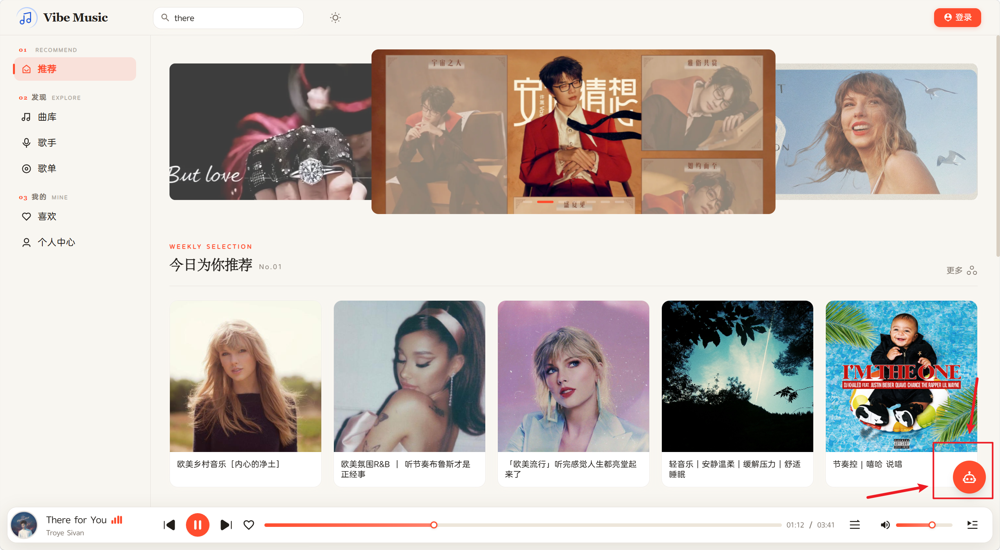
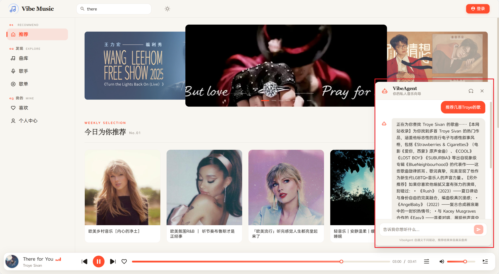
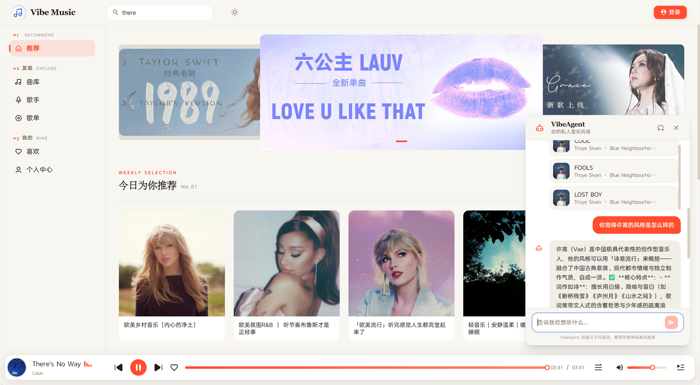

# 项目演示

> 说明: 该项目是基于 [Alex-LiSun](https://github.com/Alex-LiSun)的开源项目VibeMusic进行二次开发

### 客户端

对原项目的客户端进行了重构：

- 主界面

- 登录

- 歌手页

- 播放详情

- 新增ai助手

### 管理端
管理端默认账号密码：
- 账号：admin_1
- 密码：123456abc

管理端界面没有大改动
页面内容可以参考这里: [vibe-music-admin](https://github.com/Alex-LiSun/vibe-music-admin)
这里不做展示
